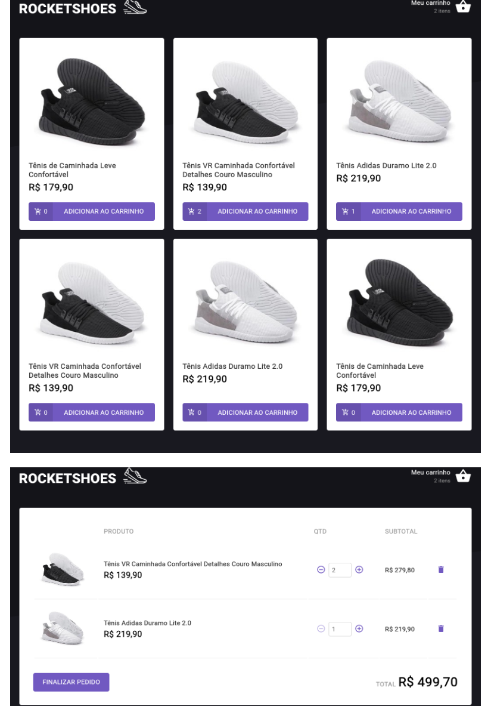

<h1 align="center">

</h1>

<h3>Desafio 3 - Criando um hook de carrinho de compras</h3>

  

  

  

<h3>Projeto</h3>

Objetivo da aplicação é criar um hook de carrinho de compras.  <a href="https://github.com/rocketseat-education/ignite-template-reactjs-criando-um-hook-de-carrinho-de-compras" target="_blank" rel="noopener noreferrer">Template</a> da aplicação

A aplicação utiliza JSON Server para simular uma API que possui as informações dos produtos e do estoque. A fake API disponibiliza os recursos <code>/stock</code> e <code>/products</code> em localhost na porta 3333

Os dados do carrinho de compra são preservados com localStorageAPI e eventuais mensagens de erro são mostradas utilizando o <strong><a href="https://github.com/fkhadra/react-toastify#readme" target="_blank" rel="noopener noreferrer">react-toastify</a></strong>

Funcionalidades desenvolvidas:

<ul>
    <li>Adicionar um novo produto ao carrinho</li>
    <li>Remover um produto do carrinho</li>
    <li>Alterar a quantidade de um produto no carrinho</li>
    <li>Cálculo dos preços sub-total e total do carrinho</li>
    <li>Validação de estoque</li>
    <li>Exibição de mensagens de erro</li>
</ul>

<h3>Instalação e Execução do Projeto</h3>
<ul>
    <li>Clone o repositório 
    <code>git clone https://github.com/silvacf/desafio-hook-de-carrinho-compras.git</code>
    </li>
    <li>Navegue até o diretório principal 
    <code>cd desafio-hook-de-carrinho-compras</code>
    </li>
    <li>Instale as dependências do projeto 
    <code>yarn</code>
    </li>
    <li>Execute o servidor 
    <code>yarn server</code>
    </li>
    <li>Execute o projeto 
    <code>yarn start</code>
    </li>
</ul>
